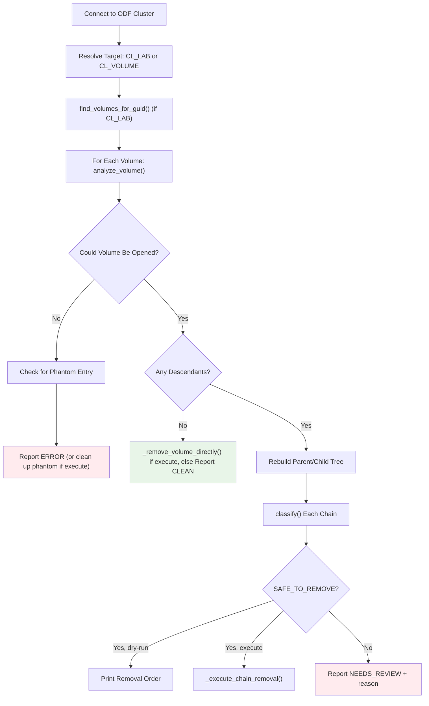

# ODF Descendant Reaper Script Documentation

## Overview
The `odf-descendant-reaper.py` script discovers and classifies stranded RBD descendant chains that block `odf-cleanup.py`'s "still has active descendants" check. It rebuilds the true parent/child tree for a volume, classifies each chain, and - in execute mode - removes what's provably safe (including the volume itself, and the RBD namespace it lived in, once nothing's left).

## Assumptions
- `odf-cleanup.py` refuses to delete a volume if `list_descendants()` returns anything active
- A chain is only safe to remove if every node in it has zero watchers, no open errors, and isn't truncated by the depth cap
- `CL_LAB` accepts either a bare GUID or the full `{config}-{guid}` volumeNamePrefix value
- Ceph client binding differences (`list_watchers`/`watchers_list`, `parent_info`/`parent`) are handled transparently

## Execution Flow
```
main() → DescendantReaper.connect() → analyze_guid() → find_volumes_for_guid() → analyze_volume() → classify() → [print or execute removal]
```

### High-Level Execution Flow Diagram



---

## Classes

### 1. `ChainNode`
**Purpose:** One image in a descendant chain rooted at an orphaned volume.

**Key Properties:**
- `watchers`, `children`, `snapshots` - discovered state for this node (each snapshot dict includes `is_trash` - RBD's "clone v2" moves a deleted snapshot with live clones into a trash namespace instead of blocking the delete; it's only removable by id via `remove_snap_by_id()`, not by name - confirmed against real cluster output that even `rbd snap rm --force` can't reach it)
- `create_timestamp` / `access_timestamp` / `modify_timestamp` - handles either a `datetime` or raw epoch return, depending on Ceph client binding version
- `error` - set if the image couldn't be opened/inspected
- `truncated` - set if this node is past `MAX_CHAIN_DEPTH`
- `phantom_image_id` - set if `error` is a confirmed phantom entry

**Key Method:**
- `all_nodes()` - flattens this node and every descendant beneath it (used by classify/removal-order/execute)

### 2. `DescendantReaper`
**Purpose:** Connects to ODF and walks/classifies descendant chains for a GUID or a specific image, or removes an explicit list of pre-vetted image names.

---

## DescendantReaper Methods (Execution Order)

### Phase 1: Connection

#### `connect()`
**Purpose:** Establishes connection to ODF cluster, same env vars/keyring convention as `odf-cleanup.py`
**Does:**
- Reads `CL_POOL`, `CL_CONF`, `CL_KEYRING`
- Creates Rados cluster connection and IO context
- Optionally calls `ioctx.set_namespace()` if `CL_RBD_NAMESPACE` is set - some provisioners isolate a lab's images into their own RBD namespace (Ceph multi-tenancy, distinct from k8s namespaces) instead of the pool's default. Every method below just uses `self.ioctx`, so this transparently scopes the whole run (chain-walking, `CL_VOLUME`, `CL_CLEANUP_LIST`) to that namespace - no other code changes needed
- Captures `my_instance_id` so its own inspection watch can be filtered out of watcher lists later

### Phase 2: Target Resolution

#### `find_volumes_for_guid()`
**When:** Only when `CL_LAB` (not `CL_VOLUME`) is set
**Does:**
- Matches on either a literal `{guid}-` prefix (works for any `{config}-{guid}` value)
- Skips csi-snap images - only inspects actual volumes

### Phase 3: Descendant Discovery & Tree Rebuild

#### `analyze_volume()`
**Purpose:** Returns `(roots, error, phantom_image_id)`
**Does:**
- Calls `list_descendants()` once on the volume - already the full recursive set, no repeated calls
- If that fails (confirmed cause: any snapshot on the image being in RBD's trash namespace makes `list_descendants()` fail outright, even though a trashed snap can still have a live child), falls back to `_walk_descendants_trash_safe()`
- For every descendant, calls `_inspect_node()` (watchers/timestamps/snapshots) and `_get_parent_name()`
- Rebuilds the real parent→child tree locally instead of treating every descendant as an independent root
- `error` is set when the volume/its descendants couldn't even be read - explicitly **not** the same as "genuinely has zero descendants", and never reported as a clean orphan
- Nodes past `MAX_CHAIN_DEPTH` are flagged `truncated` instead of guessed at

#### `_direct_children_trash_safe()` / `_walk_descendants_trash_safe()`
**When:** `list_descendants()` fails outright (trash-namespace snapshot on the image)
**Does:** `_direct_children_trash_safe()` gets one level of children via `set_snap()`/`set_snap_by_id()` per snapshot + `list_children2()` (trash-namespace snaps are only reachable by id); `_walk_descendants_trash_safe()` repeats this recursively since `list_children2()` is single-level, unlike `list_descendants()`. Both return `(children, ok)` - `ok=False` means at least one snapshot's children couldn't be listed (confirmed against real cluster output that `list_children2()` can throw the same ENOENT even via `set_snap_by_id()`) - this must surface as an `error`, never as "confirmed no children". When `list_children2()` throws on a trash-namespace snapshot, tries `_diagnose_and_repair_orphan()` before giving up - see "Orphaned Clone Repair" below.

#### `_diagnose_and_repair_orphan()` / `_repair_orphaned_clone()` / `_rollback_orphan_relink()`
**When:** `list_children2()` failed on a trash-namespace snapshot
**Purpose:** Handles a real, live corruption class - see "Orphaned Clone Repair" under Workflow Decisions for the full story and the manual procedure this automates
**Does:**
- `_diagnose_and_repair_orphan()`: reads the parent's `rbd_header`'s `snap_children_<hex snapid>` omap value directly (`_get_omap_value()`, bypassing `list_children2()`/`list_descendants()` entirely) and decodes it (`_decode_child_image_specs()`) to find the real child image id(s) RBD's clone-v2 tracking still references
- `_repair_orphaned_clone()`: confirms the candidate id matches the pattern (header exists, no `rbd_directory` entry, not in `rbd trash ls`, itself childless/snapshot-free/unwatched - re-verified through the *normal* API after relinking, never trusted from raw omap alone), then temporarily relinks it into `rbd_directory` under `orphan-recovery-<id>`, removes it via `rbd.RBD().remove()` (correctly triggers the parent-side child-detach), and lets the now-childless trashed snapshot auto-purge on its own
- `_rollback_orphan_relink()`: undoes the temporary relink (never touches the real header/data) whenever any check fails partway through - only ever reached in the failure paths, and doesn't get called at all when the repair succeeds since the image itself is gone by then
- Only executes writes when `execute=True` (i.e. `DRY_RUN=false`); otherwise just prints the diagnosis

#### `_inspect_node()`
**Does:**
- Opens one image, collects watchers (`_get_watchers`), timestamps (`_get_timestamp`), snapshot protection state (`_is_protected_snap`), and its parent name (`_get_parent_name`)
- Handles two different Ceph client binding surfaces: `list_watchers()`/`watchers_list()`, `parent_info()`/`parent()`

#### `_check_phantom_entry()` / `_check_missing_rbdid()`
**When:** A volume/image can't be opened at all
**Purpose:** Detects two known corruption patterns and sets `self._phantom_pattern` so `_format_phantom_message()`/`_execute_phantom_cleanup()` know which fix applies:
- `'phantom'`: `rbd_id.<name>` exists and resolves to an internal id, but that id's `rbd_header` object is missing (the name→id pointer survived, the metadata never landed) - unrepairable, only the dangling pointer can be cleaned up
- `'missing_rbdid'`: the inverse - `rbd_id.<name>` itself is gone, but `rbd_directory`'s `name_<name>` omap key still resolves to an id whose `rbd_header` genuinely exists. A real, valid image, just missing the convenience pointer `rbd.Image()` needs to open by name - safer/simpler to repair than an orphaned clone since two independent sources (`rbd_directory` and `rbd_header`) already agree on the id
**Does:**
- `_check_phantom_entry()`: `rados stat`s the id object, decodes the packed id value, checks whether the header exists; falls through to `_check_missing_rbdid()` if the id object doesn't exist at all
- `_check_missing_rbdid()`: reads `rbd_directory`'s `name_<name>` omap value directly (`_get_omap_value()`), decodes it, and confirms the resulting id's header exists
- Returns the resolved `image_id` for either confirmed pattern, `None` otherwise (never guesses on a third/unknown state)

### Phase 4: Classification

#### `classify()`
**Does:** Returns `SAFE_TO_REMOVE` only if every node in the chain has zero watchers, no errors, and wasn't truncated - otherwise `NEEDS_REVIEW`

#### `classify_reason()`
**Does:** Builds a human-readable reason string (active watcher / error / depth cap) for a `NEEDS_REVIEW` chain

### Phase 5: Reporting / Execution

#### `print_chain()` / `removal_order_lines()` / `print_removal_order()`
**Does:** Renders the tree and a leaf-first manual removal order (`rbd snap unprotect`/`rbd snap rm`/`rbd rm`) for review in dry-run mode

#### `_execute_chain_removal()`
**When:** `execute=True` and a chain is `SAFE_TO_REMOVE`
**Does:** Leaf-first: unprotects + removes every snapshot (trashed ones via `remove_snap_by_id()`, others via `remove_snap()`), then removes each image, directly via the RBD Python bindings - stops at the first failure rather than partially completing and reporting success

#### `_remove_volume_directly()`
**When:** `execute=True` and a volume has no descendant chains left to remove - either it never had any (the common "clean orphan" case) or `_execute_chain_removal()` just cleared them all
**Does:** Fresh `_get_watchers()` check first (state can change between analysis and this call, and `rbd.RBD().remove()` itself does **not** block on watchers), then removes/unprotects the volume's own snapshots (same trash/protected handling as `_execute_chain_removal()`) before removing the volume itself. Returns `False` on a watcher or any failure - never silently skipped as if nothing needed doing

#### `_execute_phantom_cleanup()`
**When:** `execute=True` and `_check_phantom_entry()` confirmed a pattern
**Does:** Applies whichever pattern was detected - for `'phantom'`, removes the dangling `rbd_id` object and its two `rbd_directory` omap keys; for `'missing_rbdid'`, recreates the single missing `rbd_id.<name>` object. Never touches `rbd_header` or any data object either way

### Main Orchestrator

#### `analyze_guid()`
**Purpose:** Entry point for a GUID or a specific volume
**Does:**
- Resolves target volume(s), analyzes each, prints/executes as appropriate
- Only offers/attempts removal of the volume itself once **all** its descendant chains are safe (matches what would actually let `odf-cleanup.py` succeed) - trivially true when there were zero chains to begin with, so a clean orphan is removed directly via `_remove_volume_directly()` in execute mode rather than just being reported and skipped (nothing else deletes it for GUIDs living in a named RBD namespace, since `odf-cleanup.py` can't reach those)
- Returns one of: `NO_VOLUMES_FOUND`, `ERROR`, `CLEAN` (dry-run only), `ALL_SAFE`, `NEEDS_REVIEW`, `RESOLVED` (execute-only, covers both "chains removed" and "clean orphan removed directly")

### Direct Removal Mode

#### `cleanup_named_images()`
**When:** `CL_CLEANUP_LIST` is set (a file of image names, one per line) instead of `CL_LAB`/`CL_VOLUME`
**Purpose:** Removes an explicit list of images an external caller (`odf-oc-compare.py`) already verified safe - bypasses `classify()`/chain-walking entirely, since that logic has no Kubernetes ownership awareness
**Does:**
- Per image: fresh `_get_watchers()` and `list_descendants()` check (cluster state can change between analysis and execution), then removes it (or prints what it would do, in dry-run)
- An unopenable image is checked via `_check_phantom_entry()` before being skipped
- Anything with a watcher, children, or an unresolved open error is skipped (not a failure) - only actual removal errors count as `failed`
- Returns `False` only if a removal genuinely failed

### Namespace Cleanup

#### `remove_namespace_if_empty()`
**When:** After every mode above finishes (`CL_LAB`/`CL_VOLUME`/`CL_CLEANUP_LIST`), and as the sole action when `CL_RBD_NAMESPACE` is set with none of those
**Purpose:** A named RBD namespace whose images are all gone is dead weight left behind for no reason - removes it too, so nothing needs a separate manual sweep later
**Does:**
- No-op (`True`) if `CL_RBD_NAMESPACE` wasn't set - nothing to do, not a failure
- Lists images + trash in the namespace (ioctx is already scoped there from `connect()`); if either is non-empty, leaves it alone and returns `False`
- If empty and `execute=False`, prints what it would run and returns `True`
- If empty and `execute=True`, resets the ioctx to the default namespace (`namespace_remove()` operates at the pool level, not from inside the namespace being removed) and removes it - scope is only restored to `ns` if the removal itself failed, since a successfully-removed namespace no longer exists to scope back to
- Returns `False` on any failure (couldn't list, or removal itself failed)

---

## Main Entry Point

### `main()`
**Does:**
- Derives `execute` from `DRY_RUN` (default `"true"` - discovery-only), same convention as `odf-cleanup.py`
- Validates required env vars (`CL_POOL`, `CL_CONF`, `CL_KEYRING`) and that one of `CL_LAB`/`CL_VOLUME`/`CL_CLEANUP_LIST`/`CL_RBD_NAMESPACE` (alone) is set
- `CL_CLEANUP_LIST` takes precedence and dispatches to `cleanup_named_images()` instead of `analyze_guid()`
- If none of `CL_LAB`/`CL_VOLUME`/`CL_CLEANUP_LIST` are set but `CL_RBD_NAMESPACE` is, there's nothing to analyze - just calls `remove_namespace_if_empty()` directly (namespace-only mode, used by `odf-oc-compare.py` for namespaces it found empty from the start)
- After `analyze_guid()` or `cleanup_named_images()` completes, calls `remove_namespace_if_empty()` for whatever `CL_RBD_NAMESPACE` was set (no-op if unset) - best-effort, doesn't affect the exit code from those two paths since the volume-level result already stands on its own
- Prints a live-mode warning banner when `DRY_RUN=false`
- Exit code: `0` only for `NO_VOLUMES_FOUND` / `CLEAN` / `RESOLVED` (or `cleanup_named_images()`/namespace-only mode returning `True`) - anything else is non-zero, so a calling script knows this still needs attention

---

## Key Features

### Discovery Capabilities
- **Single-Pass Descendant Scan:** One `list_descendants()` call per volume, tree rebuilt locally instead of re-querying per node
- **Cross-Version Ceph Client Support:** Transparently handles both `list_watchers()`/`watchers_list()` and `parent_info()`/`parent()` binding surfaces
- **Own-Watch Filtering:** Excludes the reaper's own inspection watch from watcher counts
- **Phantom Entry Detection:** Identifies dangling `rbd_id` pointers whose `rbd_header` is missing

### Safety Features
- **Conservative Classification:** Any error, active watcher, or depth-cap truncation forces `NEEDS_REVIEW` - never guesses
- **DRY_RUN by Default:** Discovery-only unless `DRY_RUN=false` is explicitly set
- **Narrow Execute Scope:** Only `SAFE_TO_REMOVE` chains and confirmed phantom entries are ever touched in execute mode; undiagnosed errors and active watchers are never auto-resolved
- **Fail-Stop Execution:** `_execute_chain_removal()` stops at the first failure instead of partially completing silently

### Output Generation
- **Per-Node Detail:** Watchers, timestamps (create/access/modify), snapshot counts and protection state
- **Actionable Removal Commands:** Leaf-first `rbd snap unprotect`/`rbd snap rm`/`rbd rm` order, including the base volume once all descendants are safe
- **Status Codes for Automation:** Distinct exit codes let a calling script (e.g. `odf-oc-compare.py`'s generated cleanup script) tell "resolved" apart from "still needs a human"

**Usage:**
```bash
export CL_LAB="your-guid"           # or CL_VOLUME="specific-image-name", or
export CL_CLEANUP_LIST="names.txt"  # file of pre-vetted image names to remove directly
export DRY_RUN="true"               # false to actually remove what's classified/listed safe
python3 utils/odf-descendant-reaper.py
```

**Optional:**
- `MAX_CHAIN_DEPTH` - depth cap before forcing `NEEDS_REVIEW` (default: 10)
- `CL_RBD_NAMESPACE` - RBD namespace within the pool (Ceph multi-tenancy, distinct from k8s namespaces) some provisioners isolate a lab's images into (default: pool's default namespace). Used by `odf-oc-compare.py`'s generated cleanup script for GUIDs it found living in a named namespace - `odf-cleanup.py` can't reach those (it only ever operates in the default namespace), so they're routed here instead. Can also be set **alone** (no `CL_LAB`/`CL_VOLUME`/`CL_CLEANUP_LIST`) to just remove an already-empty named namespace
- `DEBUG` - verbose diagnostics, e.g. filtered-watcher details

Orphaned clone repair (see "Orphaned Clone Repair" below) has no separate toggle - diagnosis always runs when the trash-safe fallback hits an unresolvable snapshot, and the actual repair follows the same `DRY_RUN` convention as everything else in execute mode.

---

## Workflow Decisions

### Error vs. Empty Descendants Decision

#### Decision Mechanisms:
- **Open Failure:** `rbd.Image()` / `list_descendants()` raises
- **Zero Descendants:** the call succeeds and simply returns nothing

#### Strategy:
- `analyze_volume()` returns a 3-tuple `(roots, error, phantom_image_id)` specifically so these two cases can never collapse into each other
- An open failure is checked against the phantom-entry pattern before being reported as a plain `ERROR`

#### **Key Point:**
Conflating "couldn't open it" with "genuinely nothing there" previously caused a corrupted volume to be misreported as a clean orphan - this distinction is load-bearing for correctness.

### Chain Classification Decision

#### Decision Mechanisms:
- **Watcher Check:** any external watcher anywhere in the chain
- **Error Check:** any node that couldn't be inspected
- **Depth Check:** any node past `MAX_CHAIN_DEPTH`

#### Strategy:
- **All-or-Nothing:** a chain is `SAFE_TO_REMOVE` only if every single node passes all three checks
- **No Partial Trust:** one bad node anywhere in the chain forces the whole chain to `NEEDS_REVIEW`

#### **Key Point:**
Classification is deliberately conservative - false negatives (flagging something safe as needing review) just cost a human a look; false positives (deleting something still in use) are not recoverable.

### Execute Mode Scope Decision

#### Decision Mechanisms:
- **DRY_RUN convention:** matches `odf-cleanup.py` (`true` = safe default, `false` = live)
- **Two allowed actions:** `SAFE_TO_REMOVE` chain removal, confirmed phantom entry cleanup

#### Strategy:
- Everything else a chain could be classified as (`NEEDS_REVIEW`, undiagnosed `ERROR`) is never touched automatically, regardless of `DRY_RUN`
- The volume itself is only removed once **all** of its descendant chains were actually removed successfully in this same run - including the trivial case of zero chains to begin with (a "clean orphan"), via `_remove_volume_directly()`

#### **Key Point:**
Execute mode only ever acts on causes it has fully diagnosed - anything it can't explain is left for manual review rather than guessed at. A clean orphan (no descendants at all) is the most-diagnosed case there is, so it's removed directly rather than just reported - this matters for GUIDs living in a named RBD namespace, where the reaper *is* the whole cleanup path (`odf-cleanup.py` can't reach them), not a diagnostic step before a separate tool finishes the job.

### Direct Removal Mode Decision

#### Decision Mechanisms:
- `odf-oc-compare.py`'s parentless csi-snap/csi-vol analysis already checks RBD children **and** Kubernetes ownership (`VolumeSnapshotContent`/`PersistentVolume`) - `classify()` here only ever checks watchers, so it's not a substitute
- These images have no lab GUID, so `odf-cleanup.py` (GUID-scoped) can't process them either

#### Strategy:
- Trust the caller's `SAFE TO DELETE` verdict for *which* images to target, but never trust that the cluster hasn't changed since - re-check watchers and children fresh, per image, right before removing it
- Keep this fully separate from `classify()`/chain-walking rather than trying to make that logic Kubernetes-aware too

#### **Key Point:**
This mode is deliberately dumb about *why* something is safe (that's `odf-oc-compare.py`'s job) and only responsible for confirming it's *still* safe right now.

### Orphaned Clone Repair Decision

#### Background: what an "orphaned clone" is
A third corruption class, distinct from phantom entries. `rbd_header.<id>` genuinely exists (valid `parent` pointer, real data) but the image has **no `rbd_directory` entry** (neither `name_`/`id_` key) and is **not in `rbd trash ls`** either. That makes it invisible to `rbd ls`, `list_children2()`, and `list_descendants()` - but its parent's own clone-v2 bookkeeping still references it, so the parent's trashed snapshot removal fails with `EBUSY` ("image is busy") while every discovery API reports zero children. Likely cause: a prior deletion attempt was interrupted between "unlink from directory" and "remove header".

#### Manual diagnosis procedure (what the automated repair does under the hood)
1. Confirm the symptom: `list_descendants()` throws, `_walk_descendants_trash_safe()` also returns `ok=False` on a trash-namespace snapshot even via `set_snap_by_id()` + `list_children2()`.
2. Get that snapshot's numeric id (from `rbd snap ls --all --format json` on the parent) and its own image id (`rbd info`).
3. Read the real child pointer directly, bypassing every listing API: `rados -p <pool> listomapkeys rbd_header.<parent_id>` should show a `snap_children_<snapid in 16-digit hex>` key; `rados -p <pool> getomapval rbd_header.<parent_id> snap_children_<hex> - | xxd` dumps its value.
4. Decode the value: 4-byte LE count, then per entry: 2-byte struct version header (unused), 4-byte LE body length, 8-byte LE `pool_id`, 4-byte-length-prefixed `image_id` string, 4-byte-length-prefixed `pool_namespace` string. (Byte layout reverse-engineered against 3 real cases, not from Ceph source - re-verify if it ever stops matching. See `_decode_child_image_specs()`.)
5. Confirm the extracted `image_id` matches the pattern: `rados -p <pool> getomapval rbd_directory id_<image_id> -` → "No such key"; `rbd trash ls -p <pool> --all --format json` → not present; `rados -p <pool> stat rbd_header.<image_id>` → exists.
6. Confirm it's a safe leaf: `rados -p <pool> listomapkeys rbd_header.<image_id>` should show **no** `snap_children_*` or `snapshot_*` keys (no children/snapshots of its own).
7. Temporarily relink it: write `rbd_directory`'s `name_orphan-recovery-<id>` (value: length-prefixed `<id>`) and `id_<id>` (value: length-prefixed `orphan-recovery-<id>`) omap keys, plus a matching `rbd_id.orphan-recovery-<id>` object (same encoding as the `name_` value) - same length-prefixed-string format `rbd_directory`/`rbd_id.<name>` already use for real images (verify against a known-good image's entries first, byte-for-byte, before writing anything).
8. Verify via the *normal* API: `rbd info <pool>/orphan-recovery-<id>` should now show the expected `parent`, `snapshot_count: 0`; `rbd status` should show zero watchers; `rbd children --all` should be empty.
9. `rbd rm <pool>/orphan-recovery-<id>` - this is the only genuinely destructive step, and only reachable once steps 5-8 all confirm the pattern.
10. Confirm the parent's `snap_children_<hex>` key is now gone, then retry the originally-blocked snapshot removal - it may already have auto-purged as a side effect of step 9 (`ENOENT` on retry then means success, not a new failure).

#### Decision Mechanisms:
- **Confirmed pattern:** header exists, no directory entry, not in trash, itself childless/snapshot-free/unwatched (re-verified through the normal API post-relink, not trusted from raw omap alone)
- **Depth limit:** only ever handles a single level automatically - if the orphan itself turns out to have its own children/snapshots, stop and report what was found rather than recursing
- **Any check fails → roll back** the temporary relink immediately (`_rollback_orphan_relink()`) and fall through to `NEEDS_REVIEW`, same as any other unresolvable case

#### Strategy:
- **No separate toggle** - diagnosis (reading the omap value, decoding it, printing what was found) always runs when the trash-safe fallback hits an unresolvable snapshot; only the actual relink/remove is gated on `execute=True` (`DRY_RUN=false`), same convention as every other execute-mode action in this tool. Was gated behind a dedicated `CL_ORPHAN_REPAIR` flag initially out of caution, given this writes to `rbd_directory` (even temporarily) - a materially different risk than anything else the reaper does - but removed once confirmed working live on 2 independent GUIDs with zero false positives
- **Reaper-only, not ported to `odf-cleanup.py`/`_odf-cleanup.sh`** - too invasive for an unattended, auto-triggered job; this is exactly the "extreme case" tier the reaper exists for, while `odf-cleanup.py` handles normal operation

#### **Key Point:**
Confirmed and fixed live against a real cluster (see git history / session notes for the full trace): the orphan was found, the byte format was validated against two known-good relationships before trusting the decode of the mystery one, and the repair correctly cleared an `EBUSY` that had been blocking a GUID's entire cleanup chain.

### Clean Orphan / Namespace Cleanup Decision

#### Background:
For a GUID living in a named RBD namespace, `odf-oc-compare.py` routes its cleanup entirely to this reaper (`odf-cleanup.py` can't reach that namespace at all). Originally, `analyze_guid()` only ever removed the volume itself once a real descendant chain had been walked and found all-safe - a volume with **zero** descendants to begin with (the common case) was just reported as a "clean orphan" and skipped, on the assumption `odf-cleanup.py` would delete it next. That assumption doesn't hold for named-namespace GUIDs - nothing else ever runs for them, so those volumes were silently never actually deleted. The empty RBD namespace left behind afterward has the same problem: nothing was ever responsible for removing it either, active GUID or not.

#### Decision Mechanisms:
- **Zero descendants is the trivial case of "all chains safe":** a clean orphan is just a volume with an empty chain list - `all_safe` starts `True` and the loop over zero chains never flips it, so the existing "remove the volume once safe" branch already fires correctly once it's not special-cased away with an early `continue`
- **Watcher check added, not assumed:** `rbd.RBD().remove()` doesn't block on watchers by default, so both the clean-orphan and real-chain root removal paths go through the same `_remove_volume_directly()` helper, which re-checks watchers fresh first (state can change between analysis and this call)
- **Namespace removal is separate from GUID/volume success:** `remove_namespace_if_empty()` runs after `analyze_guid()`/`cleanup_named_images()` regardless of their outcome - it just checks emptiness itself and no-ops harmlessly if there's still content, so it can't turn a real success into a false failure or vice versa
- **Namespace-only mode for the "always was empty" case:** `odf-oc-compare.py` also finds named namespaces with zero images/trash from the very first scan - no GUID ever existed there to route through `CL_LAB`, so `CL_RBD_NAMESPACE` was made valid to set **alone**, dispatching straight to `remove_namespace_if_empty()` with nothing else to do

#### Strategy:
- **Never delete an active lab's namespace:** an empty RBD namespace is only actually dead weight if its own embedded GUID (RBD namespace names mirror k8s namespace names) doesn't match a currently-active OCP namespace - `odf-oc-compare.py` checks this before ever flagging one (see its own Workflow Decisions), the reaper itself just trusts the caller and removes what it's told to once confirmed empty
- **Same removal safety everywhere:** one helper (`_remove_volume_directly()`) for every "remove this volume directly" call site, so the watcher/snapshot handling can't drift between the clean-orphan case and the real-chain case

#### **Key Point:**
A "clean orphan" and an "empty namespace" are both the *good* outcome, not a stopping point - previously they were dead ends that silently left real cleanup undone.
