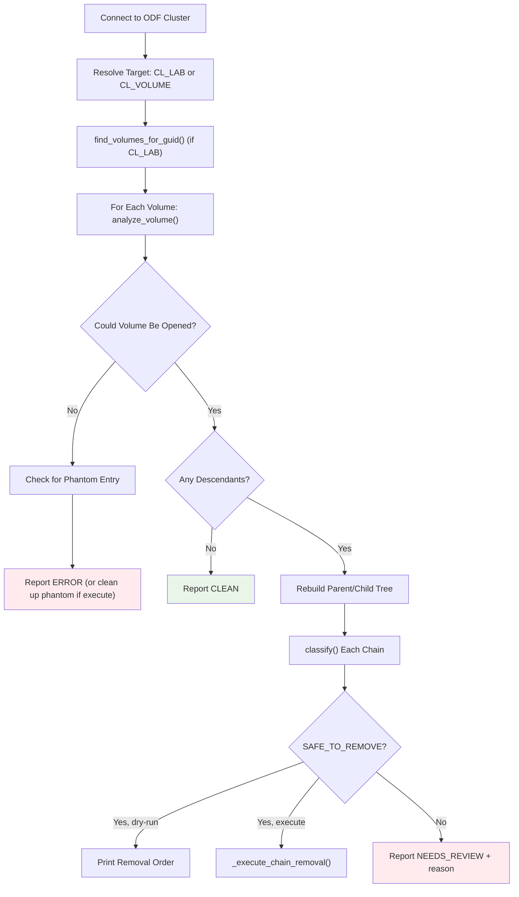

# ODF Descendant Reaper Script Documentation

## Overview
The `odf-descendant-reaper.py` script discovers and classifies stranded RBD descendant chains that block `odf-cleanup.py`'s "still has active descendants" check. It rebuilds the true parent/child tree for a volume, classifies each chain, and - in execute mode - removes what's provably safe.

## Assumptions
- `odf-cleanup.py` refuses to delete a volume if `list_descendants()` returns anything active
- A chain is only safe to remove if every node in it has zero watchers, no open errors, and isn't truncated by the depth cap
- `CL_LAB` accepts either a bare GUID or the full `{config}-{guid}` volumeNamePrefix value
- Ceph client binding differences (`list_watchers`/`watchers_list`, `parent_info`/`parent`) are handled transparently

## Execution Flow
```
main() → DescendantReaper.connect() → analyze_guid() → find_volumes_for_guid() → analyze_volume() → classify() → [print or execute removal]
```

### High-Level Execution Flow Diagram



---

## Classes

### 1. `ChainNode`
**Purpose:** One image in a descendant chain rooted at an orphaned volume.

**Key Properties:**
- `watchers`, `children`, `snapshots` - discovered state for this node
- `create_timestamp` / `access_timestamp` / `modify_timestamp` - handles either a `datetime` or raw epoch return, depending on Ceph client binding version
- `error` - set if the image couldn't be opened/inspected
- `truncated` - set if this node is past `MAX_CHAIN_DEPTH`
- `phantom_image_id` - set if `error` is a confirmed phantom entry

**Key Method:**
- `all_nodes()` - flattens this node and every descendant beneath it (used by classify/removal-order/execute)

### 2. `DescendantReaper`
**Purpose:** Connects to ODF and walks/classifies descendant chains for a GUID or a specific image, or removes an explicit list of pre-vetted image names.

---

## DescendantReaper Methods (Execution Order)

### Phase 1: Connection

#### `connect()`
**Purpose:** Establishes connection to ODF cluster, same env vars/keyring convention as `odf-cleanup.py`
**Does:**
- Reads `CL_POOL`, `CL_CONF`, `CL_KEYRING`
- Creates Rados cluster connection and IO context
- Captures `my_instance_id` so its own inspection watch can be filtered out of watcher lists later

### Phase 2: Target Resolution

#### `find_volumes_for_guid()`
**When:** Only when `CL_LAB` (not `CL_VOLUME`) is set
**Does:**
- Matches on either a literal `{guid}-` prefix (works for any `{config}-{guid}` value)
- Skips csi-snap images - only inspects actual volumes

### Phase 3: Descendant Discovery & Tree Rebuild

#### `analyze_volume()`
**Purpose:** Returns `(roots, error, phantom_image_id)`
**Does:**
- Calls `list_descendants()` once on the volume - already the full recursive set, no repeated calls
- For every descendant, calls `_inspect_node()` (watchers/timestamps/snapshots) and `_get_parent_name()`
- Rebuilds the real parent→child tree locally instead of treating every descendant as an independent root
- `error` is set when the volume/its descendants couldn't even be read - explicitly **not** the same as "genuinely has zero descendants", and never reported as a clean orphan
- Nodes past `MAX_CHAIN_DEPTH` are flagged `truncated` instead of guessed at

#### `_inspect_node()`
**Does:**
- Opens one image, collects watchers (`_get_watchers`), timestamps (`_get_timestamp`), snapshot protection state (`_is_protected_snap`), and its parent name (`_get_parent_name`)
- Handles two different Ceph client binding surfaces: `list_watchers()`/`watchers_list()`, `parent_info()`/`parent()`

#### `_check_phantom_entry()`
**When:** A volume/image can't be opened at all
**Purpose:** Detects a specific known corruption pattern - `rbd_id.<name>` exists and resolves to an internal id, but that id's `rbd_header` object is missing (the name→id pointer survived, the metadata never landed)
**Does:**
- `rados stat`s the id object, decodes the packed id value, then checks whether the header object exists
- Returns the resolved `image_id` only when the header is confirmed missing

### Phase 4: Classification

#### `classify()`
**Does:** Returns `SAFE_TO_REMOVE` only if every node in the chain has zero watchers, no errors, and wasn't truncated - otherwise `NEEDS_REVIEW`

#### `classify_reason()`
**Does:** Builds a human-readable reason string (active watcher / error / depth cap) for a `NEEDS_REVIEW` chain

### Phase 5: Reporting / Execution

#### `print_chain()` / `removal_order_lines()` / `print_removal_order()`
**Does:** Renders the tree and a leaf-first manual removal order (`rbd snap unprotect`/`rbd snap rm`/`rbd rm`) for review in dry-run mode

#### `_execute_chain_removal()`
**When:** `execute=True` and a chain is `SAFE_TO_REMOVE`
**Does:** Leaf-first: unprotects + removes every snapshot, then removes each image, directly via the RBD Python bindings - stops at the first failure rather than partially completing and reporting success

#### `_execute_phantom_cleanup()`
**When:** `execute=True` and `_check_phantom_entry()` confirmed a phantom
**Does:** Removes the dangling `rbd_id` object and its two `rbd_directory` omap keys via `rados` - never touches `rbd_header` (already gone) or any data object

### Main Orchestrator

#### `analyze_guid()`
**Purpose:** Entry point for a GUID or a specific volume
**Does:**
- Resolves target volume(s), analyzes each, prints/executes as appropriate
- Only offers/attempts removal of the volume itself once **all** its descendant chains are safe (matches what would actually let `odf-cleanup.py` succeed)
- Returns one of: `NO_VOLUMES_FOUND`, `ERROR`, `CLEAN`, `ALL_SAFE`, `NEEDS_REVIEW`, `RESOLVED` (execute-only)

### Direct Removal Mode

#### `cleanup_named_images()`
**When:** `CL_CLEANUP_LIST` is set (a file of image names, one per line) instead of `CL_LAB`/`CL_VOLUME`
**Purpose:** Removes an explicit list of images an external caller (`odf-oc-compare.py`) already verified safe - bypasses `classify()`/chain-walking entirely, since that logic has no Kubernetes ownership awareness
**Does:**
- Per image: fresh `_get_watchers()` and `list_descendants()` check (cluster state can change between analysis and execution), then removes it (or prints what it would do, in dry-run)
- An unopenable image is checked via `_check_phantom_entry()` before being skipped
- Anything with a watcher, children, or an unresolved open error is skipped (not a failure) - only actual removal errors count as `failed`
- Returns `False` only if a removal genuinely failed

---

## Main Entry Point

### `main()`
**Does:**
- Derives `execute` from `DRY_RUN` (default `"true"` - discovery-only), same convention as `odf-cleanup.py`
- Validates required env vars (`CL_POOL`, `CL_CONF`, `CL_KEYRING`) and that one of `CL_LAB`/`CL_VOLUME`/`CL_CLEANUP_LIST` is set
- `CL_CLEANUP_LIST` takes precedence and dispatches to `cleanup_named_images()` instead of `analyze_guid()`
- Prints a live-mode warning banner when `DRY_RUN=false`
- Exit code: `0` only for `NO_VOLUMES_FOUND` / `CLEAN` / `RESOLVED` (or `cleanup_named_images()` returning `True`) - anything else is non-zero, so a calling script knows this still needs attention

---

## Key Features

### Discovery Capabilities
- **Single-Pass Descendant Scan:** One `list_descendants()` call per volume, tree rebuilt locally instead of re-querying per node
- **Cross-Version Ceph Client Support:** Transparently handles both `list_watchers()`/`watchers_list()` and `parent_info()`/`parent()` binding surfaces
- **Own-Watch Filtering:** Excludes the reaper's own inspection watch from watcher counts
- **Phantom Entry Detection:** Identifies dangling `rbd_id` pointers whose `rbd_header` is missing

### Safety Features
- **Conservative Classification:** Any error, active watcher, or depth-cap truncation forces `NEEDS_REVIEW` - never guesses
- **DRY_RUN by Default:** Discovery-only unless `DRY_RUN=false` is explicitly set
- **Narrow Execute Scope:** Only `SAFE_TO_REMOVE` chains and confirmed phantom entries are ever touched in execute mode; undiagnosed errors and active watchers are never auto-resolved
- **Fail-Stop Execution:** `_execute_chain_removal()` stops at the first failure instead of partially completing silently

### Output Generation
- **Per-Node Detail:** Watchers, timestamps (create/access/modify), snapshot counts and protection state
- **Actionable Removal Commands:** Leaf-first `rbd snap unprotect`/`rbd snap rm`/`rbd rm` order, including the base volume once all descendants are safe
- **Status Codes for Automation:** Distinct exit codes let a calling script (e.g. `odf-oc-compare.py`'s generated cleanup script) tell "resolved" apart from "still needs a human"

**Usage:**
```bash
export CL_LAB="your-guid"           # or CL_VOLUME="specific-image-name", or
export CL_CLEANUP_LIST="names.txt"  # file of pre-vetted image names to remove directly
export DRY_RUN="true"               # false to actually remove what's classified/listed safe
python3 utils/odf-descendant-reaper.py
```

**Optional:**
- `MAX_CHAIN_DEPTH` - depth cap before forcing `NEEDS_REVIEW` (default: 10)
- `DEBUG` - verbose diagnostics, e.g. filtered-watcher details

---

## Workflow Decisions

### Error vs. Empty Descendants Decision

#### Decision Mechanisms:
- **Open Failure:** `rbd.Image()` / `list_descendants()` raises
- **Zero Descendants:** the call succeeds and simply returns nothing

#### Strategy:
- `analyze_volume()` returns a 3-tuple `(roots, error, phantom_image_id)` specifically so these two cases can never collapse into each other
- An open failure is checked against the phantom-entry pattern before being reported as a plain `ERROR`

#### **Key Point:**
Conflating "couldn't open it" with "genuinely nothing there" previously caused a corrupted volume to be misreported as a clean orphan - this distinction is load-bearing for correctness.

### Chain Classification Decision

#### Decision Mechanisms:
- **Watcher Check:** any external watcher anywhere in the chain
- **Error Check:** any node that couldn't be inspected
- **Depth Check:** any node past `MAX_CHAIN_DEPTH`

#### Strategy:
- **All-or-Nothing:** a chain is `SAFE_TO_REMOVE` only if every single node passes all three checks
- **No Partial Trust:** one bad node anywhere in the chain forces the whole chain to `NEEDS_REVIEW`

#### **Key Point:**
Classification is deliberately conservative - false negatives (flagging something safe as needing review) just cost a human a look; false positives (deleting something still in use) are not recoverable.

### Execute Mode Scope Decision

#### Decision Mechanisms:
- **DRY_RUN convention:** matches `odf-cleanup.py` (`true` = safe default, `false` = live)
- **Two allowed actions:** `SAFE_TO_REMOVE` chain removal, confirmed phantom entry cleanup

#### Strategy:
- Everything else a chain could be classified as (`NEEDS_REVIEW`, undiagnosed `ERROR`) is never touched automatically, regardless of `DRY_RUN`
- The volume itself is only removed once **all** of its descendant chains were actually removed successfully in this same run

#### **Key Point:**
Execute mode only ever acts on causes it has fully diagnosed - anything it can't explain is left for manual review rather than guessed at.

### Direct Removal Mode Decision

#### Decision Mechanisms:
- `odf-oc-compare.py`'s parentless csi-snap/csi-vol analysis already checks RBD children **and** Kubernetes ownership (`VolumeSnapshotContent`/`PersistentVolume`) - `classify()` here only ever checks watchers, so it's not a substitute
- These images have no lab GUID, so `odf-cleanup.py` (GUID-scoped) can't process them either

#### Strategy:
- Trust the caller's `SAFE TO DELETE` verdict for *which* images to target, but never trust that the cluster hasn't changed since - re-check watchers and children fresh, per image, right before removing it
- Keep this fully separate from `classify()`/chain-walking rather than trying to make that logic Kubernetes-aware too

#### **Key Point:**
This mode is deliberately dumb about *why* something is safe (that's `odf-oc-compare.py`'s job) and only responsible for confirming it's *still* safe right now.
